  

#  熱伝導解析@openfoam
- CADでastファイルを作る
    1. スケッチを作成
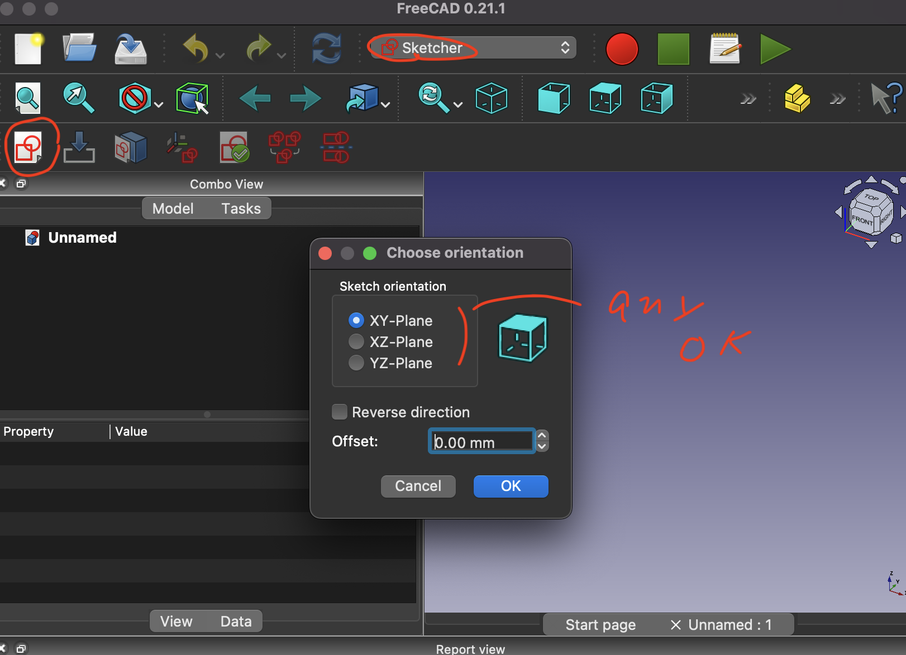
    1. ①四角形を描画②横幅調整③縦幅調整④中心との距離調整
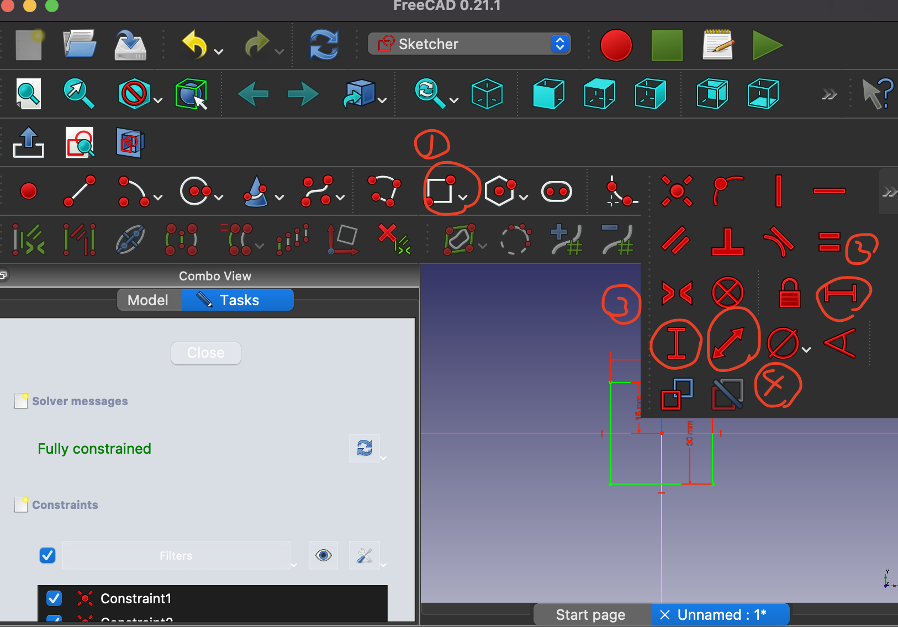
    1. スケッチを押し出してソリッドを作成
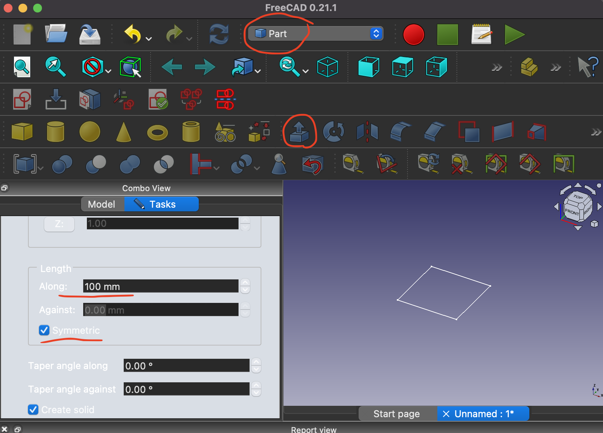
    1. ソリッドからサーフェスを作成(下矢印ボタンを2回押す)

    1. fileメニューからサーフェスをastファイルとして出力(複数一括出力もOK)
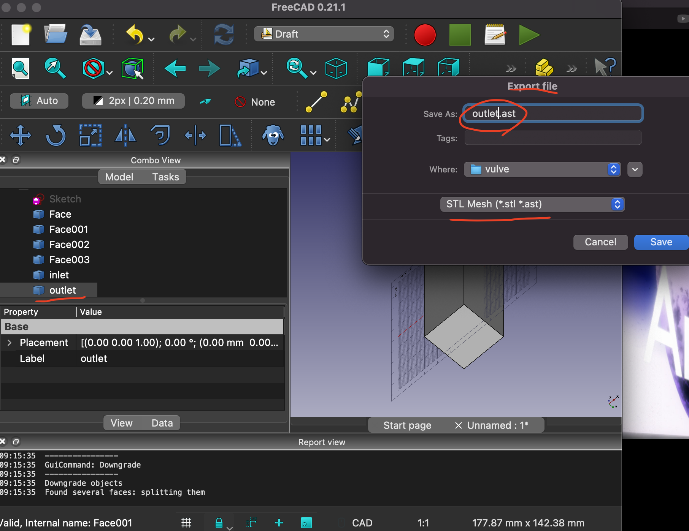
    1. この後は部分ごとにメッシュを作成するケースについて説明  
    1. astファイルを部分ごとにわけて保存(ここではupとdown)  
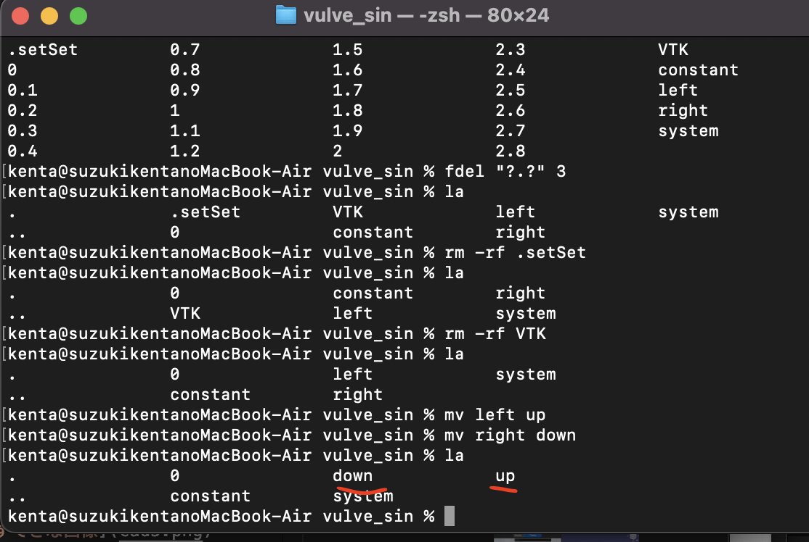
    1. astファイル内のMeshの部分を任意のサーフェス名に置換 
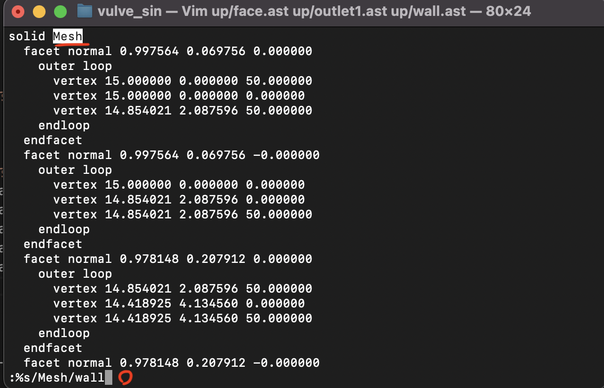
- stlファイルの準備
    1. astファイルを一つにまとめる
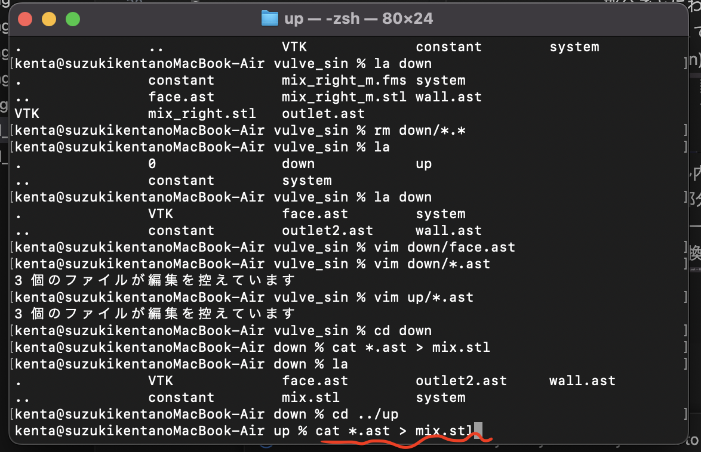
    1. cadは寸法がmmで設定されているため、mに変換(openfoamの機能を使用)
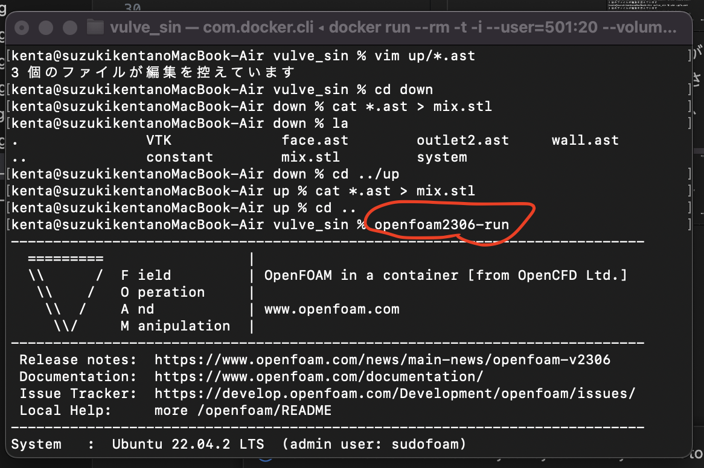
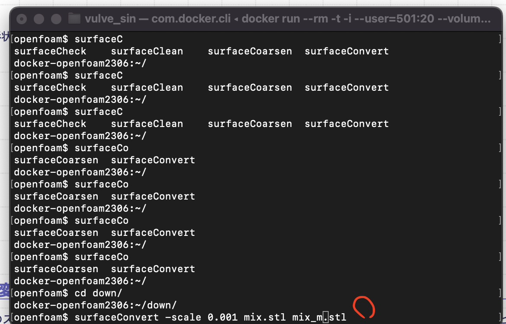
    1. 特徴線を抽出する(綺麗にメッシュが切れるようになる操作という理解でOK)
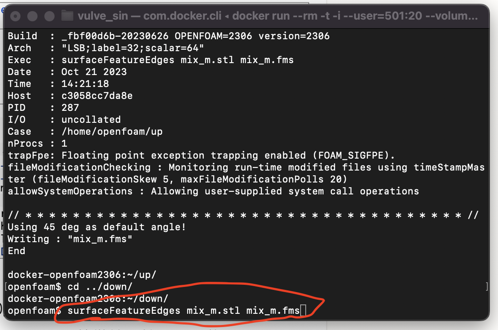
- メッシュを作成
    1. system/meshDictを編集し、対象のfmsファイルを選択、メッシュサイズを設定
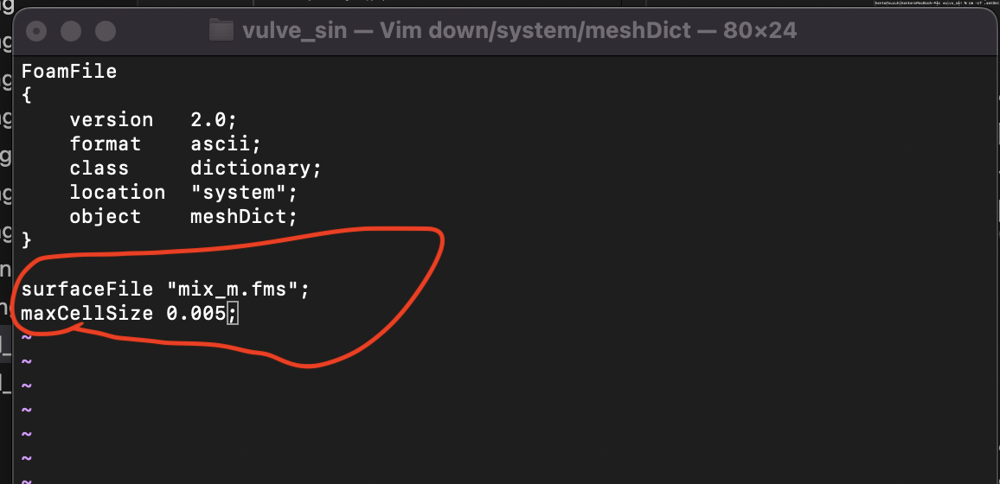
    1. 任意のメッシャーでメッシュを作成(今回はpMesh)
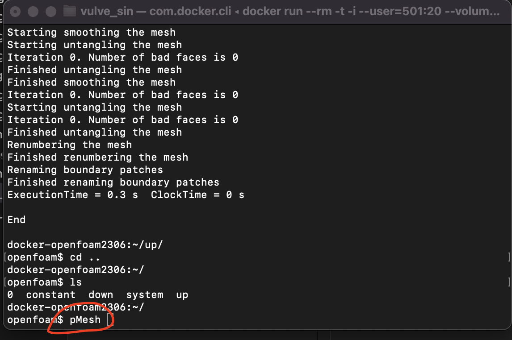
    1. 個別のメッシュをマージ①マージ対象のメッシュ情報を移動②マージコマンドを実行
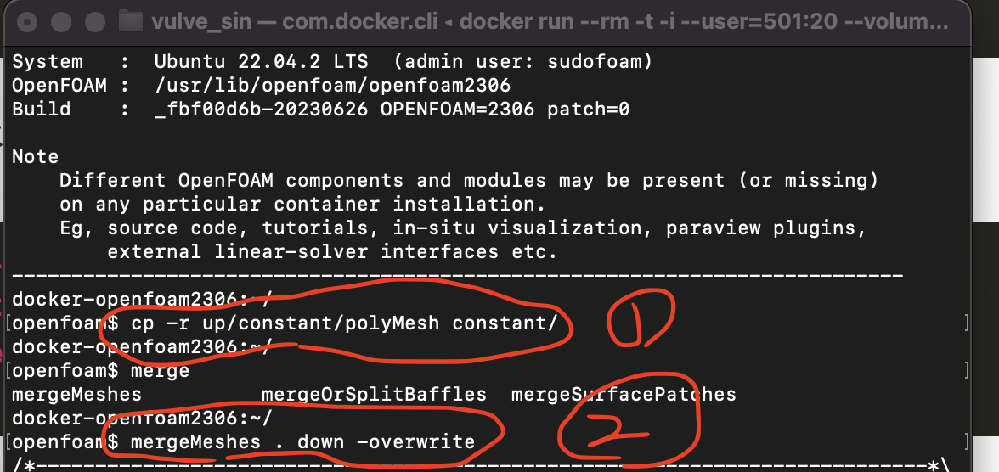
- 解析条件を設定
    1. 壁面タイプを設定 今回は全てWall outletとinletはpatchでも良い file:constant/polyMesh/boundary
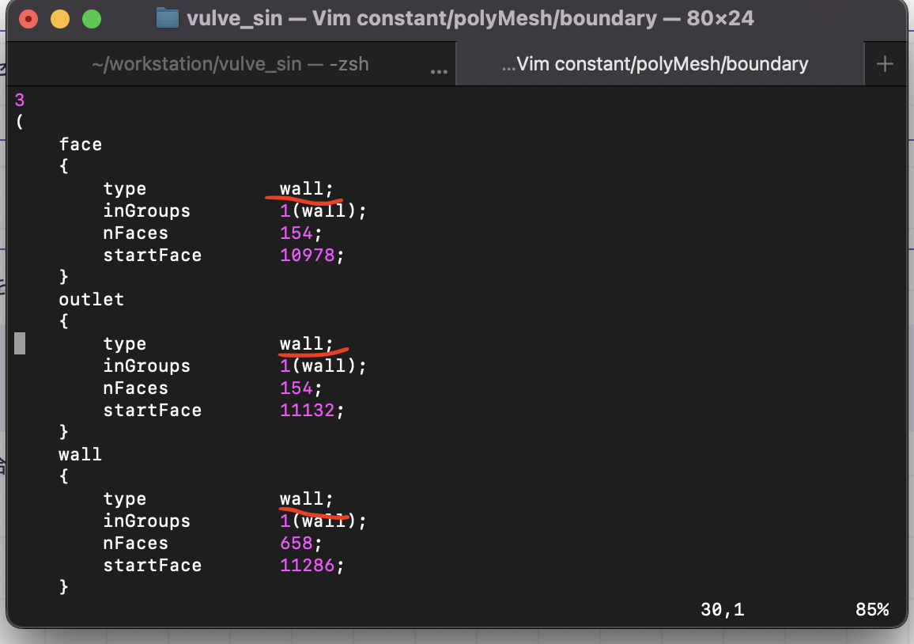
    1. 境界条件を設定 file:0/T
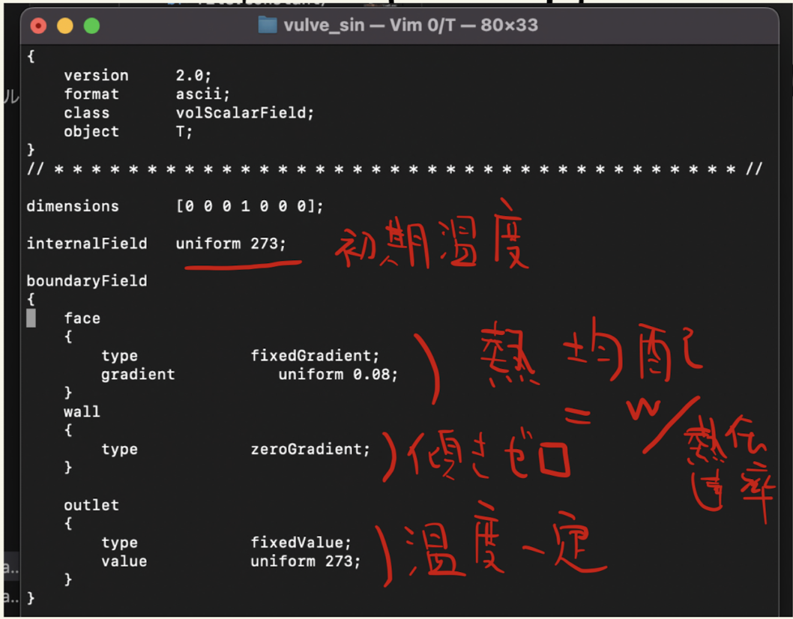
- 解析を実行する 今回はlaplacianFoam
- 解析結果を可視化 command:foamToVTK
 

---

